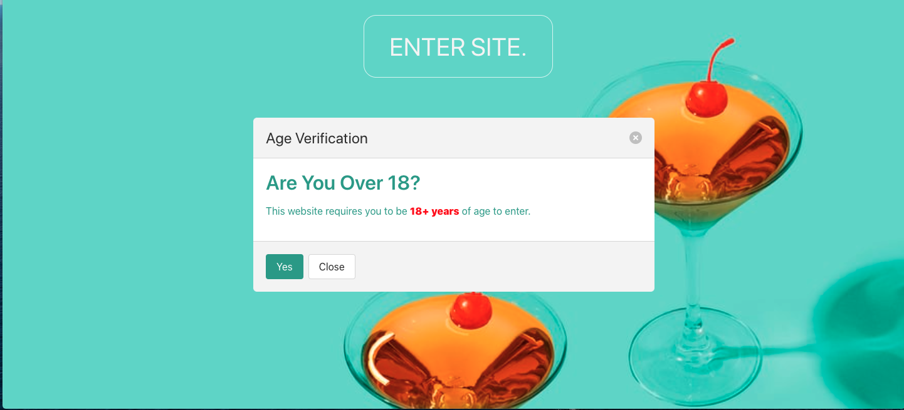
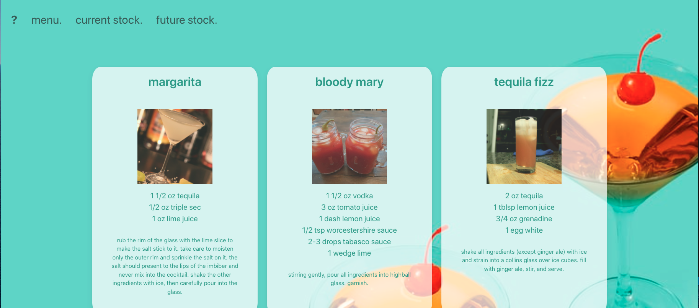
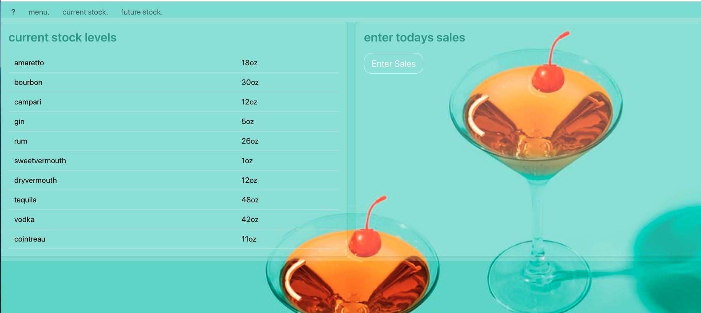
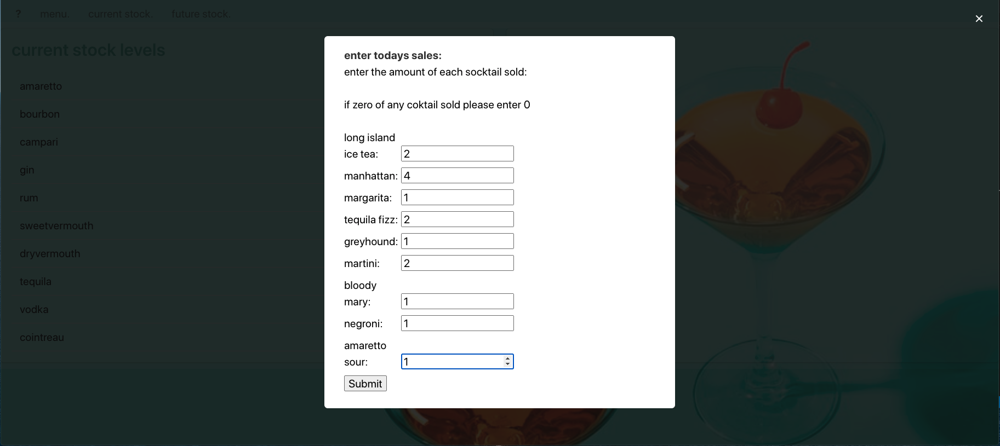
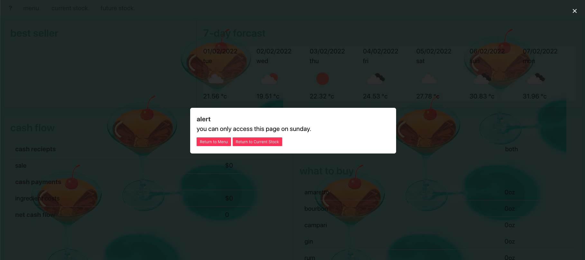
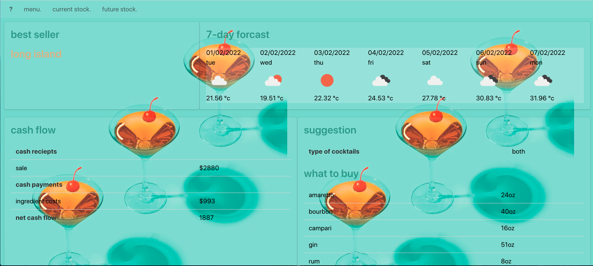

# Project 1: Cocktail Bar Stocktake Application

## About the Project

* This web based application is designed to help manage the stock at a small cocktail bar. 

* The application will feature 3 pages, a menu page, a current stock page and a future stock page. 

* The menu will have a list of all the cocktails along with pictures of the cocktails, ingredients and methods they are made.

* The current stock page will show how much of each spirit is in stock, and allow you to enter in how many of each cocktail was sold that day.

* The future stock page will show the most popular cocktail, the upcoming weather, a cash flow tables and then give a suggestion on what stock to buy for the upcoming week based on sales from the previous week and the upcoming weather.


## User Story

```
AS A cocktail bar manager
I WANT have a web application to help me with ordering stock each week based on sales for the previous week and the upcoming weather
SO THAT I can efficiently manage my bar and have sufficient stock for the upcoming week.
```


## Acceptance Criteria

Here are the critical requirements necessary for the project:

```
GIVEN a web application to help my coktail bar manage stock.
WHEN I load the menu page
THEN I am presented with a modal to check the user is over 18
WHEN I view the menu page
THEN I am presented with all the cocktails available, their ingredients, how they are made, and a picture of each cocktail
WHEN I click on the link's in the navbar
THEN I am taken to the relevant pages
WHEN I am on the current stock page
THEN I am presented with the current stock on the left hand side and a modal to enter stock on the right hand side
WHEN I click on the modal
THEN I am able to enter in how many of each cocktail I have sold that day and the current stock will be updated
WHEN I am on the future stock page
THEN I am presented with the most popular cocktail for that week, the upcoming weather, the type of cocktails that are going to be upcoming in the next week (both, hot or cold), a cash flow table and a suggestion of what to buy
WHEN I am trying to access the future stock page when it is not a sunday (the day of stock ordering)
THEN I am presnted with a modal with options to return to the menu page or the current stock page
WHEN I click the button "accept & save"
Then I will be able to see the current stock has changed on the current stock page.
```

## Finished Product

> **Note** : This shows the landing page with the age checker modal.


> **Note** : This shows the menu page


> **Note** : This shows the page for current stock


> **Note** : This shows the modal for entering the cocktails sold that day


> **Note** : This shows the modal for if the user is trying to enter the future stock page when it is not Sunday


> **Note** : This shows the page for future stock



## Links


* https://lconnell1000.github.io/Project-1/

* https://github.com/lconnell1000/Project-1

- - -
© Developed by Ash Weston, Huy Vo, Lachlan Connell and Luke Weber January 2022.
